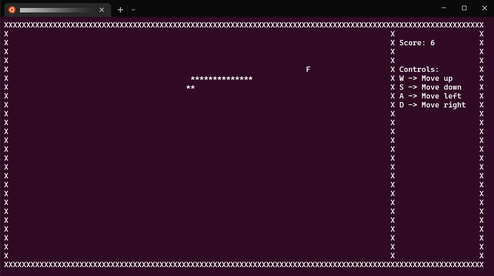

<p align="center">
<a href="https://github.com/InfiniZest/Project2.3110/blob/e62bd5d007ffd21e52c2cc91a25af91f62089752/Snake%20logo.png"></a>
</p>

## Play Snake in your Console
<p align="center">
<a href="https://github.com/InfiniZest/Project2.3110/blob/53958d58a0967fc46ec19e86c101193bf3d5dcbe/SnakeScreenshot.png"></a>
</p>

The following program uses C++ with NCurses to build a playable game of snake in the console shell. This was a rework of an old assignment from my Advanced Programming Techniques—CISC 3110 class.
Looking at previous commits dating back 6 years ago, I had no idea what I was doing and it was one of my goals to revisit and fix this project. I'll have a more detailed blog regarding this over at [my blog soon](https://infinizest.github.io/ik096.github.io).

<br/>

The project was based off of C boilerplate code provided by my professor Scott Dexter. See commit [7465bf9](https://github.com/InfiniZest/Project2.3110/commit/7465bf9f584676dbc30a570e0966314ccf99a5be) for boilerplate code.

## Installation

You should be able to run this game on any Linux and Windows Subsystem For Linux (WSL) distros.

On your console, make you have both GCC and NCurses installed on your system and run the following:

```
g++ ./console.h ./console.cpp ./Position.h ./Position.cpp ./Food.h ./Food.cpp ./Snake.h ./Snake.cpp ./snake_c.cpp -lncurses

./a.out
```

<br/>
<p align="center"> <b>Have fun! 🐍⌨</b> </p>
